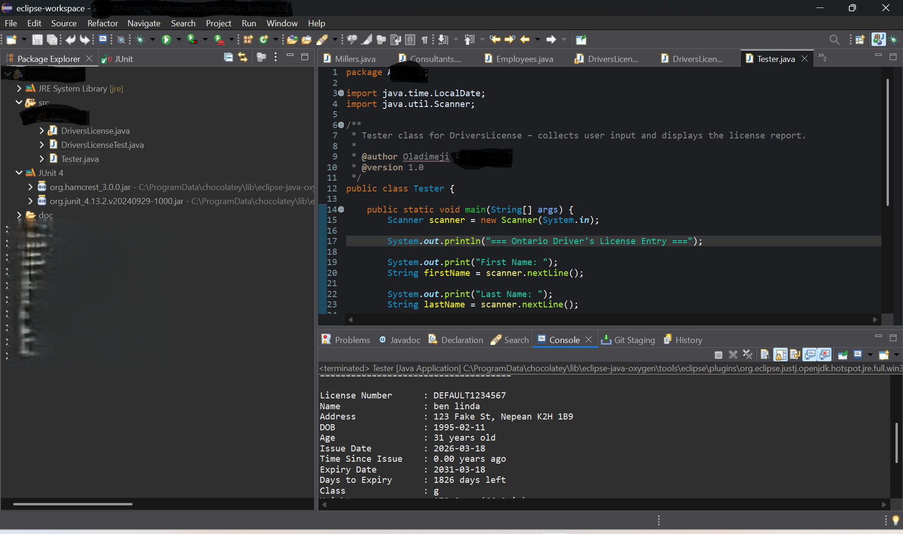
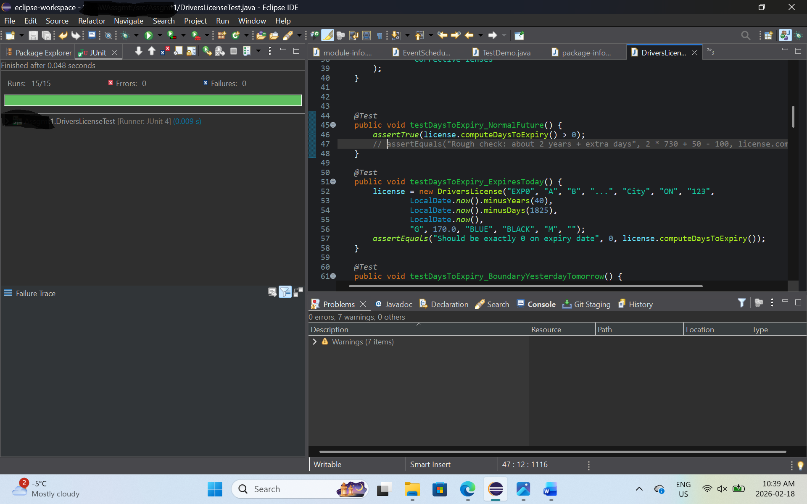
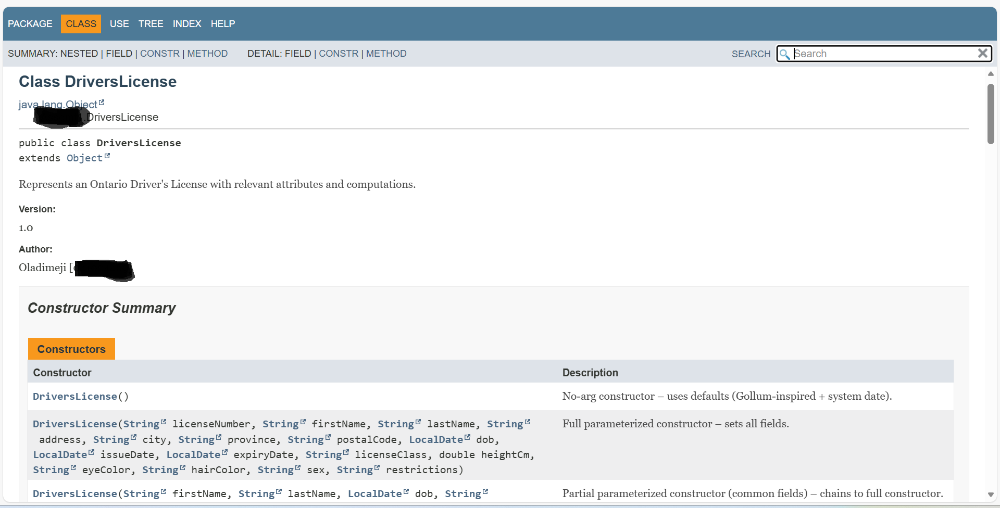

Testing
Includes a full JUnit 4 test suite with strong boundary coverage:

License expiring today, tomorrow, and yesterday
Age edge cases
Height conversion (extreme, zero, negative values)
Issue date variations

Run tests via: Right-click DriversLicenseTest.java → Run As → JUnit Test
Screenshots
Program Running

JUnit Results

Javadoc

Author
Oladimeji Durojaiye
Student ID: 041024469
Course: CST 8284 – Object Oriented Programming (Java)
Algonquin College